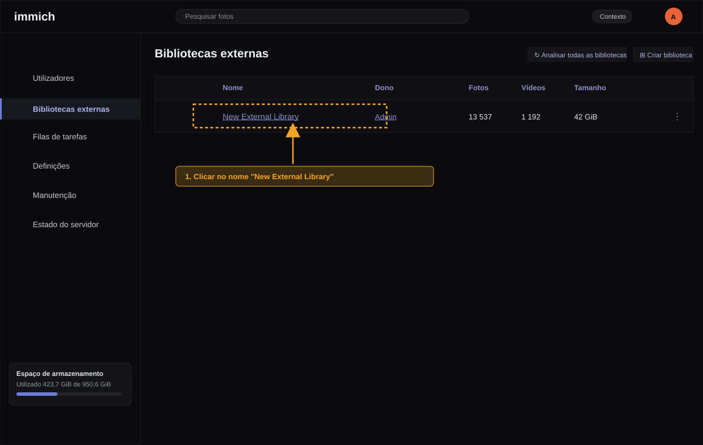
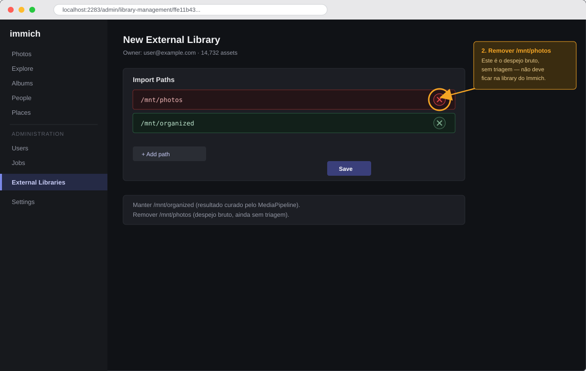
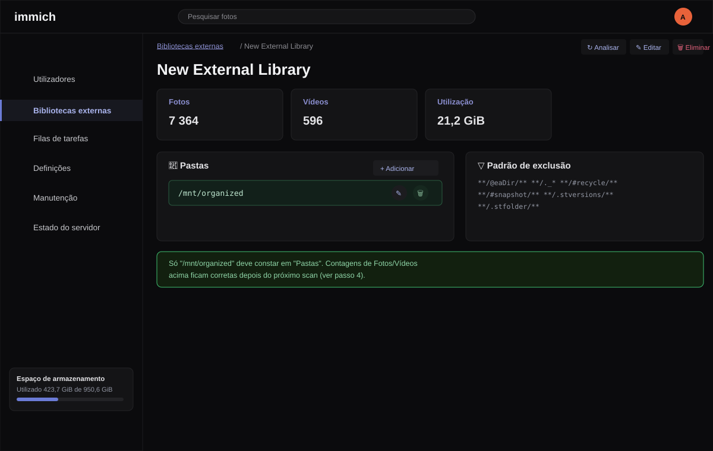
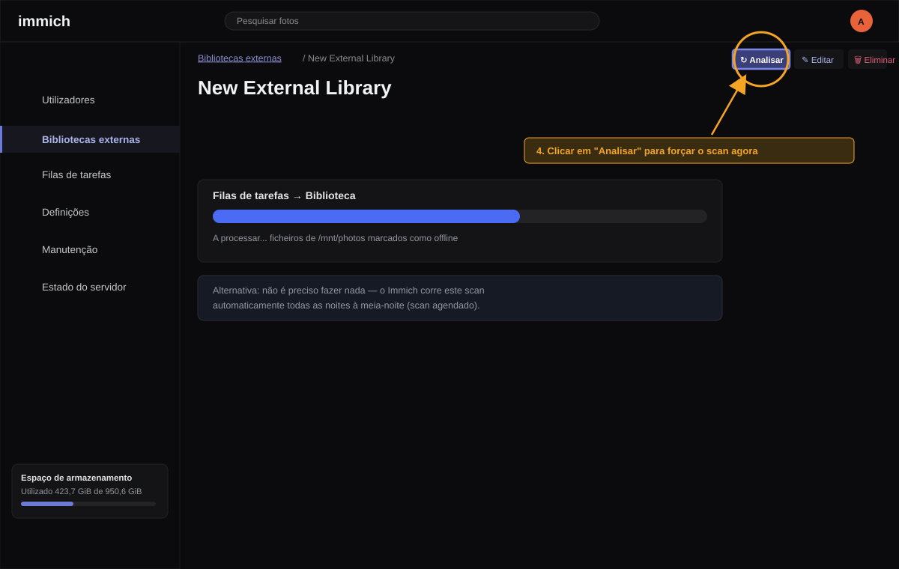

# Configuração da External Library no Immich

> As imagens deste guia são mockups ilustrativos (não capturas de ecrã reais)
> que reproduzem o layout do painel de administração do Immich, para servir
> de referência visual a quem não conhece a interface.

## Porque é que este guia existe

Por omissão, é fácil a External Library do Immich acabar a apontar tanto
para `photos/` (o despejo bruto do telemóvel, sem qualquer triagem) como
para `organized/` (o resultado curado por este pipeline). Foi exatamente
isto que aconteceu nesta instalação e que motivou este guia.

Quando isto acontece, dois problemas surgem ao mesmo tempo:

- O Immich mostra tudo o que está em `photos/` sem qualquer triagem —
  capturas de ecrã, documentos, quase-duplicados — exatamente o conteúdo que
  este pipeline existe para filtrar antes de ser considerado "backup real".
- Cada ficheiro que passa pelo pipeline e chega a `organized/` fica indexado
  **duas vezes** no Immich: uma vez a partir de `photos/` (original) e outra
  a partir de `organized/` (a cópia curada).

A correção é simples, mas não é óbvia se não se souber onde procurar: a
External Library só deve ter `/mnt/organized` como import path — nunca
`/mnt/photos`.

---

## Passo 1 — Ver as External Libraries

Abrir o Immich no browser (`http://localhost:2283` nesta instalação) e ir a
**Administration → External Libraries**.

Clicar em **Edit** na library existente para ver os import paths atuais.

---

## Passo 2 — Verificar e remover `/mnt/photos`

Se o campo **Import Paths** mostrar `/mnt/photos` **e** `/mnt/organized` em
conjunto, é este o problema a corrigir:

1. Clicar no ícone de remover (✕) na linha `/mnt/photos`.
2. Confirmar que `/mnt/organized` continua na lista.
3. Clicar em **Save**.

**Não remover `/mnt/organized`** — é esse o path que deve ficar.

---

## Passo 3 — Forçar uma nova análise (scan)

Alterar os import paths **não remove imediatamente** os ficheiros já
indexados a partir de `/mnt/photos` — isso só acontece na próxima análise
(scan) da library.

1. Na página da library, clicar em **Scan Library Files** para forçar a
   análise de imediato.
2. Acompanhar o progresso em **Administration → Jobs**.

Se não quiser fazer nada manualmente, o Immich corre isto de qualquer forma
todas as noites à meia-noite — ver `library.scan.cronExpression` em
`immich-config.json`.

---

## O que esperar depois do scan

- Os ficheiros indexados a partir de `/mnt/photos` passam a **offline** no
  Immich e são movidos para o lixo (retenção de 30 dias antes de apagar
  definitivamente — configurável em `immich-config.json` → `trash.days`).
- **Os ficheiros originais em disco não são tocados.** A library está
  montada como só-leitura (`:ro` em `docker-compose.yml`), por isso o Immich
  só pode alterar o seu próprio índice, nunca os ficheiros de origem.
- O que sobra no Immich passa a corresponder exatamente ao resultado curado
  deste pipeline (`organized/`), incluindo o histórico de reconhecimento
  facial (pessoas/rostos), que se mantém para os ficheiros que também
  existem em `organized/`.

---

## Nota histórica

Esta configuração incorreta (`/mnt/photos` **e** `/mnt/organized` na mesma
library) foi identificada e corrigida diretamente na base de dados do
Immich em 2026-08-11, depois de se confirmar que a library ativa tinha
14 732 ativos indexados — cerca do dobro dos ~7 364 ficheiros reais — porque
cada ficheiro estava a ser contado duas vezes. Existe uma cópia de
segurança do estado anterior da tabela `library` em
`pipeline_state/immich_backup/` (fora do controlo de versões, local a cada
instalação).

Este guia existe para o caso de ser necessário repetir o processo — por
exemplo, depois de recriar a library, reinstalar o Immich, ou configurar uma
nova instalação.
