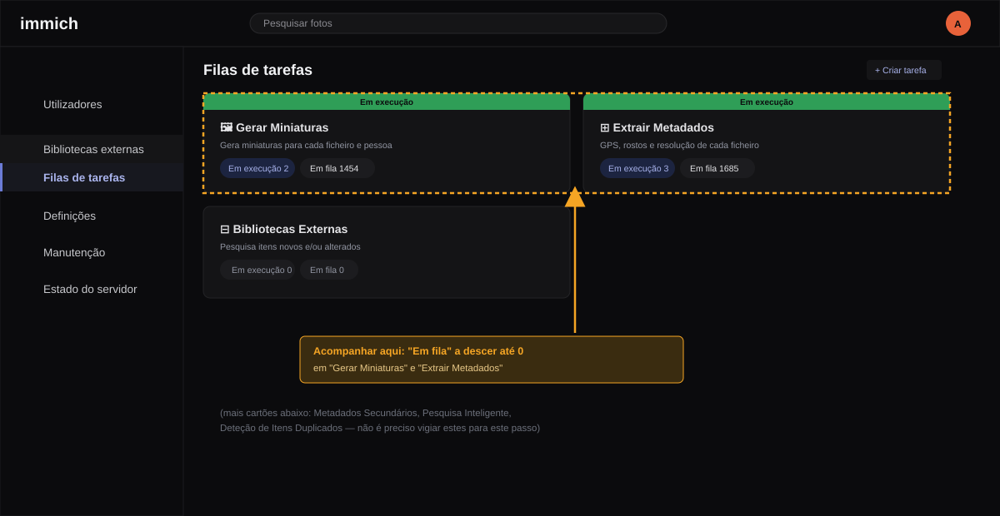

# Configuração da Biblioteca Externa no Immich

> As imagens deste guia são mockups ilustrativos, redesenhados a partir de
> capturas de ecrã reais desta instalação (Immich v3.1.0, interface em
> português) — não são capturas diretas, mas seguem de perto o layout e a
> terminologia reais.

## Porque é que este guia existe

Por omissão, é fácil a Biblioteca Externa do Immich acabar a apontar tanto
para `photos/` (o despejo bruto do telemóvel, sem qualquer triagem) como
para `organized/` (o resultado curado por este pipeline). Foi exatamente
isto que aconteceu nesta instalação e que motivou este guia.

Quando isto acontece, dois problemas surgem ao mesmo tempo:

- O Immich mostra tudo o que está em `photos/` sem qualquer triagem —
  capturas de ecrã, documentos, quase-duplicados — exatamente o conteúdo que
  este pipeline existe para filtrar antes de ser considerado "backup real".
- Cada ficheiro que passa pelo pipeline e chega a `organized/` fica indexado
  **duas vezes** no Immich: uma vez a partir de `photos/` (original) e outra
  a partir de `organized/` (a cópia curada).

A correção é simples, mas não é óbvia se não se souber onde procurar: em
**Pastas**, a biblioteca só deve ter `/mnt/organized` — nunca `/mnt/photos`.

---

## Passo 1 — Abrir "Bibliotecas externas"

No menu lateral de administração, clicar em **Bibliotecas externas**
(segundo item, ícone de estante) — não em "Definições". A secção
"Biblioteca Externa" dentro de Definições controla o comportamento global
(análise periódica, etc.), não os caminhos de uma biblioteca específica.

Clicar no nome **New External Library** para abrir os detalhes.

---

## Passo 2 — Verificar e remover `/mnt/photos`

Na página de detalhes da biblioteca, o painel **Pastas** lista os caminhos
indexados. Se mostrar `/mnt/photos` **e** `/mnt/organized` em conjunto, é
este o problema a corrigir:

1. Clicar no ícone de caixote do lixo 🗑 ao lado de `/mnt/photos`.
2. Confirmar que `/mnt/organized` continua na lista.

**Não remover `/mnt/organized`** — é esse o caminho que deve ficar. O painel
**Padrão de exclusão** ao lado (`**/@eaDir/**`, `**/.stfolder/**`, etc.) não
precisa de ser alterado.

---

## Passo 3 — Forçar uma nova análise

Remover `/mnt/photos` de **Pastas** **não remove imediatamente** os
ficheiros já indexados a partir desse caminho — isso só acontece na próxima
análise da biblioteca.

1. No topo da página da biblioteca, clicar em **Analisar** para forçar a
   análise de imediato.
2. Acompanhar o progresso em **Filas de tarefas** (menu lateral) — depois de
   analisar, é normal ver picos temporários em **Gerar Miniaturas** e
   **Extrair Metadados** (não só em "Bibliotecas Externas"), porque
   caminhos novos ou alterados disparam reprocessamento nessas filas
   também. O que interessa é o número em "Em fila" descer até 0.

Isto pode demorar de minutos a mais tempo, dependendo do volume e do
hardware — não é preciso ficar a vigiar, só confirmar mais tarde que "Em
fila" chegou a 0.

Se não quiser fazer nada manualmente, o Immich corre isto de qualquer forma
todas as noites à meia-noite — ver `library.scan.cronExpression` em
`immich-config.json`.

---

## O que esperar depois da análise

- Os ficheiros indexados a partir de `/mnt/photos` passam a **offline** no
  Immich e são movidos para o lixo (retenção de 30 dias antes de apagar
  definitivamente — configurável em `immich-config.json` → `trash.days`).
- **Os ficheiros originais em disco não são tocados.** A biblioteca está
  montada como só-leitura (`:ro` em `docker-compose.yml`), por isso o Immich
  só pode alterar o seu próprio índice, nunca os ficheiros de origem.
- As contagens de **Fotos** e **Vídeos** nos cartões do topo da página
  **podem subir antes de descer**, sobretudo se a biblioteca não for
  analisada há muito tempo — o Immich está a reconciliar tudo o que mudou
  desde a última análise de uma só vez (incluindo ficheiros que mudaram de
  pasta dentro de `organized/` por causa de revisões anteriores), não só a
  remover `/mnt/photos`. Estes cartões parecem contar também os ativos já
  no lixo, por isso só estabilizam de facto quando as filas em **Filas de
  tarefas** chegarem a 0. O número fiável para confirmar é o de ficheiros
  ativos na página de detalhes da biblioteca (ver nota abaixo) — não o
  número mostrado a meio do processo.
- O que sobra no Immich (a **timeline principal**, não a página de admin)
  passa a corresponder exatamente ao resultado curado deste pipeline,
  incluindo o histórico de reconhecimento facial (pessoas/rostos), que se
  mantém para os ficheiros que também existem em `organized/`.

### Limpar o lixo (opcional)

Os itens marcados offline vão para o **Lixo** do Immich (menu principal, não
o de administração) e são apagados automaticamente ao fim de 30 dias. Podes
esvaziar o lixo manualmente mais cedo se quiseres — usa a opção de esvaziar
lixo **na própria interface do Immich**, nunca apagando registos
diretamente na base de dados: uma eliminação em massa por SQL arrisca deixar
miniaturas, embeddings de pesquisa e outros dados relacionados órfãos, que
só a aplicação sabe limpar corretamente. Em qualquer dos casos, os
ficheiros originais nunca são afetados — o lixo do Immich só apaga o
próprio índice.

---

## Nota histórica

Esta configuração incorreta (`/mnt/photos` **e** `/mnt/organized` na mesma
biblioteca) foi identificada e corrigida diretamente na base de dados do
Immich em 2026-08-11, depois de se confirmar que a biblioteca ativa tinha
14 732 ativos indexados — cerca do dobro dos ~7 364 ficheiros reais — porque
cada ficheiro estava a ser contado duas vezes. Existe uma cópia de
segurança do estado anterior da tabela `library` em
`pipeline_state/immich_backup/` (fora do controlo de versões, local a cada
instalação). A correção foi confirmada visualmente na interface a
2026-08-12: o painel **Pastas** já só mostra `/mnt/organized`.

Este guia existe para o caso de ser necessário repetir o processo — por
exemplo, depois de recriar a biblioteca, reinstalar o Immich, ou configurar
uma nova instalação.
