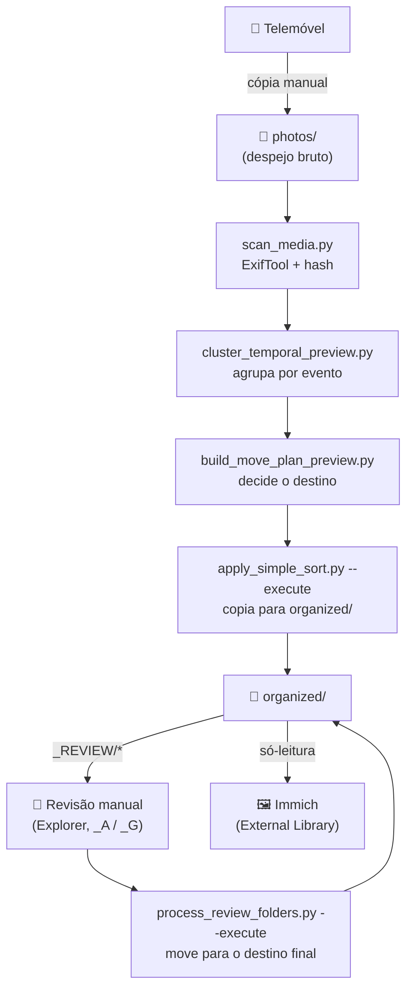

# Workflow Completo

Visão geral de todo o processo, desde as fotos saírem do telemóvel até
estarem organizadas e visíveis no Immich. Este documento é o ponto de
entrada — para o detalhe de cada parte, ver:

- [`GUIA_UTILIZACAO.md`](GUIA_UTILIZACAO.md) — como correr os scripts do
  pipeline, passo a passo.
- [`IMMICH_LIBRARY_SETUP.md`](IMMICH_LIBRARY_SETUP.md) — como configurar (e
  corrigir) o Immich para consumir o resultado.
- [`TROUBLESHOOTING.md`](TROUBLESHOOTING.md) — problemas comuns.

---

## As duas metades do processo

É importante perceber que este workflow tem duas partes independentes, com
responsabilidades diferentes:

1. **Organização física** (este repositório, `scripts/`) — decide onde cada
   ficheiro deve ficar, copia-o de `photos/` para `organized/`, e dá-te uma
   pasta `_REVIEW` para decidires manualmente os casos duvidosos. É aqui que
   a "triagem" acontece.
2. **Consumo/visualização** (Immich) — lê `organized/` (só-leitura) e
   constrói a sua própria timeline, pesquisa e mapa a partir daí. O Immich
   **não organiza nem move ficheiros** — só mostra o que já está decidido.

Se o Immich estiver a ler `photos/` (o despejo bruto) em vez de só
`organized/`, a triagem da parte 1 deixa de ter efeito prático — ver
[`IMMICH_LIBRARY_SETUP.md`](IMMICH_LIBRARY_SETUP.md).

---

## Diagrama

---

## Tabela resumo

| # | Ação | Quem/O quê | O que faz | Output |
|---|------|-----------|-----------|--------|
| 0 | Copiar fotos do telemóvel | Manual | Copia ficheiros para `photos/` | Ficheiros brutos em `photos/` |
| 1 | `scan_media.py` | Script | ExifTool (data, câmara, GPS) + hash sha256. Incremental — só reprocessa ficheiros novos/alterados | `media_registry.jsonl` |
| 2 | `summarize_registry.py` | Script | Estatísticas do registo (informativo, não altera nada) | `media_registry_summary.json` |
| 3 | `cluster_temporal_preview.py` | Script | Deriva a data/hora mais fiável (EXIF → nome do ficheiro → fallback), agrupa ficheiros próximos no tempo em clusters ("eventos") | `event_cluster_preview.json` |
| 4 | `build_move_plan_preview.py` | Script | Decide o destino de cada ficheiro: auto / review / general / skip (já em `organized/`, via índice de hashes) | `move_plan_preview.*` |
| 5 | `apply_simple_sort.py --execute` | Script | **Copia** (nunca move) de `photos/` para `organized/`: pastas diárias automáticas, `_REVIEW`, `_GENERAL` | Ficheiros em `organized/` |
| — | *(atalho para 1–5)* | `run_pipeline.py` | Corre os passos 1 a 5 numa única chamada | — |
| 6 | Revisão manual | Manual | Abrir `organized/_REVIEW/` no Explorer, decidir, renomear a pasta com `_A` ou `_G` | Pastas `_REVIEW/...` renomeadas |
| 7 | `process_review_folders.py --execute` | Script | Lê o sufixo da pasta, **move** os ficheiros para o destino final. Não analisa conteúdo — só executa a decisão | Ficheiros no destino final |
| 8 | Immich (External Library) | Software externo | Lê `organized/` só-leitura, faz o **seu próprio** parsing (EXIF, faces, thumbnails) para a timeline/pesquisa dele | Biblioteca navegável |

---

## Perguntas frequentes sobre a fronteira entre as duas metades

**"O Immich já organiza as fotos por data — para que preciso do resto?"**
O Immich organiza a *visualização* (timeline, mapa, pesquisa), mas nunca
decide o que é "confiável" o suficiente para entrar sem revisão. Não separa
capturas de ecrã, documentos, ou fotos com timestamp duvidoso — mostra tudo
o que encontrar. Os passos 1–7 são o que decide isso antes de o conteúdo
chegar ao Immich.

**"Se eu renomear uma pasta `_REVIEW` com `_A`, isso aparece logo no Immich?"**
Não diretamente — `process_review_folders.py --execute` move os ficheiros
dentro de `organized/`; o Immich só os vê na próxima análise (manual, via
botão "Analisar", ou automática à meia-noite). Ver
[`IMMICH_LIBRARY_SETUP.md`](IMMICH_LIBRARY_SETUP.md#passo-3--forçar-uma-nova-análise).

**"Preciso de reorganizar manualmente dentro do Immich?"**
Não. A organização em pastas (`_REVIEW`, `_GENERAL`, pastas diárias) só
existe no sistema de ficheiros — é para a tua revisão manual em Explorer,
não para o Immich. O Immich lê o resultado final e constrói a sua própria
vista (timeline por data, sem pastas), independentemente de como os
ficheiros estão fisicamente arrumados dentro de `organized/`.
